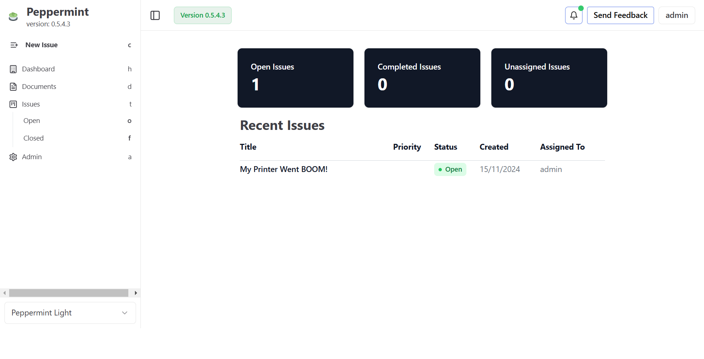
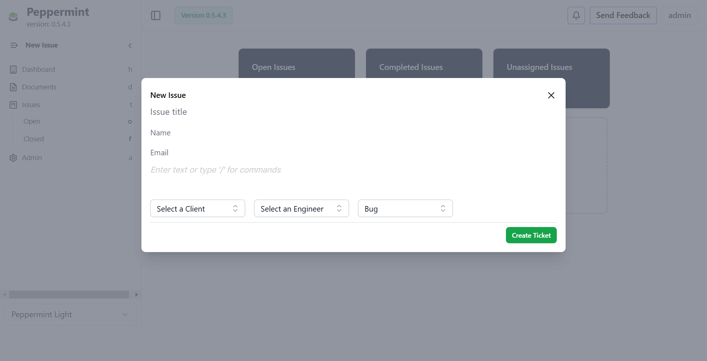
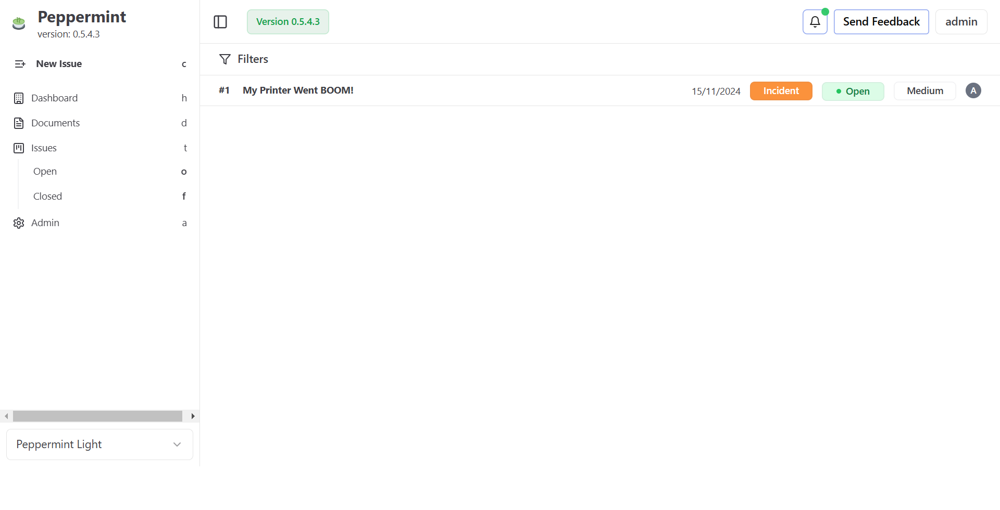
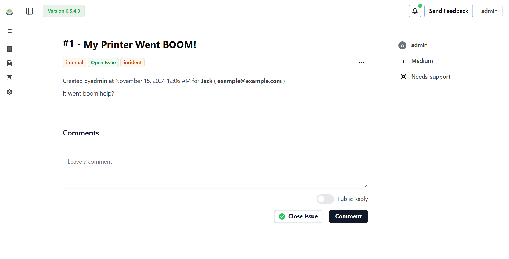

<h1 align="center">Welcome to Peppermint Ticket Management 🍵</h1>
<p align="center">
  <a href='https://ko-fi.com/peppermintsh' target='_blank'>
 </p>
<p align="center">
  
  <a target="_blank">
    
  </a>
  
</p>
<p align="center">
    
</p>
<p align="center">This project is supported by:</p>
<p align="center">
  <a href="https://www.digitalocean.com/">
    
  </a>
</p>

> Ticket Management System in order to help helpdesks & service desks manage internal staff & customer requests

## Introduction

<p align="center">
It's a self hosted alternative to popular services such as zendesk
</p>

## ✨ Features

- **Ticket Creation**: Bog standard ticket creation with a markdown editor and file uploads
- **A log of client history**
- **Markdown based Notebook with todo lists**
- **Responsive**: Designed for variable screen sizes from mobile up to 4k
- **Multi-deployment**: Quickly deploy using docker & pm2
- **Simple to Use**: Designed to be easy to use with a simple logical workflow

## 🐳 Installation with docker

Check out the getting started guide if this is the first time you've used Peppermint:

```
version: "3.1"

services:
  postgres:
    container_name: postgres
    image: postgres:latest
    restart: always
    volumes:
      - ./docker-data/db:/data/db
    environment: 
      POSTGRES_USER: peppermint
      POSTGRES_PASSWORD: 1234
      POSTGRES_DB: peppermint

  client:
    container_name: peppermint
    image: pepperlabs/peppermint:latest
    ports:
      - 5000:5000
    restart: on-failure
    depends_on:
      - postgres
    environment:
      PORT: 5000
      DB_USERNAME: peppermint
      DB_PASSWORD: 1234
      DB_HOST: 'postgres'
      BASE_URL: "http://localhost:5000"

```

Once this is completed then you can go to your base_url which was added to the compose file and login.

The default login credentials are
```
admin@admin.com
1234
```

## One click installers

- We are now on linode marketplace we can be viewed here <a href="https://www.linode.com/marketplace/apps/peppermint-lab/peppermint/">here</a>

## Documentation

We have started working on creating documentation for peppermint which covers development to general usage. Click <a href="https://docs.peppermint.sh">here</a> to be taken directly there.

## Motivation

- This was initially a project to tie together my react and nodeJS skills and show something for my portfolio
- It looked terrible! But it worked and showed functionaility, which got me a job.
- Learn and deploy with docker
- Redo the UI, completly from the ground up. Which has now been completed and for me looks great.
- Build on this foundation and create a fully fledged product which offers what the big boys offer, but, at a much better ROI than signing up for zendesk etc.

Give a ⭐️ if this project helped you!

## Screenshots

<p align="center">
    
    
    
    
</p>

## Star History


[](https://star-history.com/#Peppermint-Lab/peppermint&Date)


## Author

👤 **Jack Andrews**

- Website: [peppermint.sh](https://peppermint.sh/)
- Twitter: [@andrewsjack18 ](https://twitter.com/andrewsjack18)
- Github: [@potts99](https://github.com/potts99)
- LinkedIn: [@jack-andrews-146852131](https://linkedin.com/in/jack-andrews-146852131)
